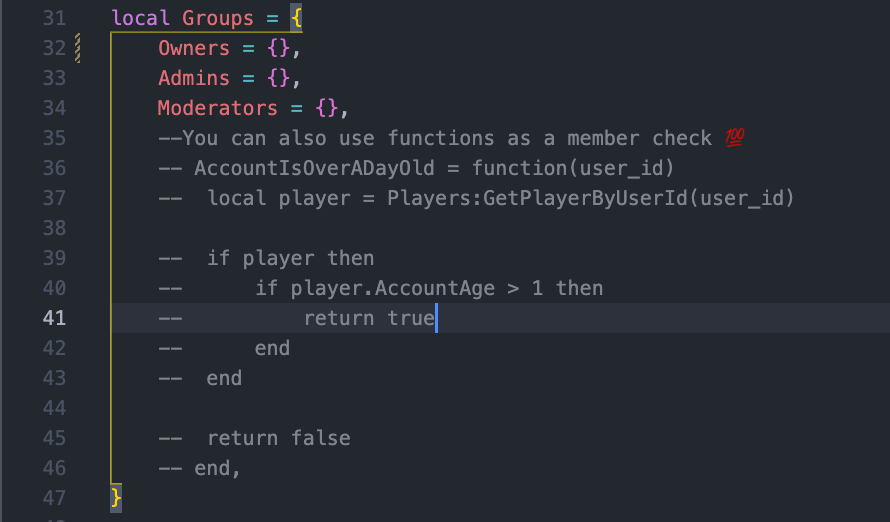

A module to manage the registering and running of commands made with <a href="https://eryn.io/Cmdr/" target="_blank">`Cmdr`</a>

## Setting Up

### Giving Yourself Permissions To Run Commands

1. Locate the permissions module in `ServerScriptService.server.Services.CommandBarService.Hooks`
2. Add your UserId to the `Owners` table
   

	!!! warning
		All members of Owners are able to run commands regardless of whether or not they have been distinctly given permission in the command description module. I recommend only including yourself or the account that manages the game in this table.

### Creating Commands

1. Locate the commands folder in `ServerScriptService.server.Services.CommandBarService`
2. Create a new folder give it the a name of the command you want to create `Test`
3. Create a module with the same name as the folder that returns a description of the command
   ```lua
	return {
		Name = "test",
		Aliases = {},
		Description = "Test.",
		Group = "Owners, Admins, Moderators", --The string just has to contain everyone that has access to these commands and is checked by the Hooks.Permissions BeforeRun function
		Args = {
			{
				Type = "string",
				Name = "input",
				Description = "some input",
			},
		},
	}
   ```
4. Next we create the module to actually run when a command is run and give it the same name as the folder but add `Server` to the end. This is used by `CommandBarService` to identify the module to handle the running of the command
```lua
return function(context, fromPlayers, toPlayer)
	return "Ran Test."
end
```   

### Permissions

Cmdr uses a BeforeRun and AfterRun system called hooks to filter attempts to run a command and serve as a way to bind functions to after events run.

1. To register hooks navigate to the Hooks folder in `ServerScriptService.server.Services.CommandBarService`
2. Create a module that similar to this to register new hooks

```lua
--!strict

--[[
{C.G.T}

-[Permissions]---------------------------------------
	A module made to determine if a player has the permissions run a commands .
	
	Members:
	
	Functions:
	
	Members [ClassName]:
	
	Methods [ClassName]:
	
--]]

local SETTINGS = {}

----- Loaded Modules -----

local Players = game:GetService("Players")

----- Module Table -----

local Permissions

----- Private Variables -----

local Groups = {
	Owners = { 69420 },
	Admins = {},
	Moderators = {}, 

	--You can also use functions as a member check 💯
	-- AccountIsOverADayOld = function(user_id)
	-- 	local player = Players:GetPlayerByUserId(user_id)

	-- 	if player then
	-- 		if player.AccountAge > 1 then
	-- 			return true
	-- 		end
	-- 	end

	-- 	return false
	-- end,
}

----- Private functions -----

----- Public -----

Permissions = function(registry)
	registry:RegisterHook("BeforeRun", function(context)
		if table.find(Groups.Owners, context.Executor.UserId) then
			return
		end

		for group_name: string, member_check: { number } | () -> boolean | nil in pairs(Groups) do
			if type(member_check) == "table" then
				if string.find(group_name, context.Group) then
					if table.find(member_check, context.Executor.UserId) then
						return
					end
				end
			elseif type(member_check) == "function" then
				local success, response = pcall(member_check, context.Executor.UserId)

				if success == true and response == true then
					return
				end
			end
		end

		return "You do not meet the requirements to run this command"
	end)
end

----- Initialize & Connections -----

return Permissions
```

3. This module is included in `C.G.T` and is responsible for determining who has permissions to run commands
4. You can give yourself permissions to run commands by adding your `UserId` to the `Groups` table.
```lua
local Groups = {
	Owners = { 69420 },
	Admins = {},
	Moderators = {}, 

	--You can also use functions as a member check 💯
	-- AccountIsOverADayOld = function(user_id)
	-- 	local player = Players:GetPlayerByUserId(user_id)

	-- 	if player then
	-- 		if player.AccountAge > 1 then
	-- 			return true
	-- 		end
	-- 	end

	-- 	return false
	-- end,
}
```

1. Lastly make sure you give yourself other members of your team permission to run the command by including their group in the description module.
```lua
return {
	Name = "test",
	Aliases = {},
	Description = "Test.",
	Group = "Owners, Admins, Moderators", --The string just has to contain everyone that has access to these commands and is checked by the Hooks.Permissions BeforeRun function
	Args = {
		{
			Type = "string",
			Name = "input",
			Description = "some input",
		},
	},
}
```
6. Members of Groups can either be a table or a function the purpose of having functions is to allow you to add additional logic, examples include checking account age, playtime, is a member of the star creator group e.t.c