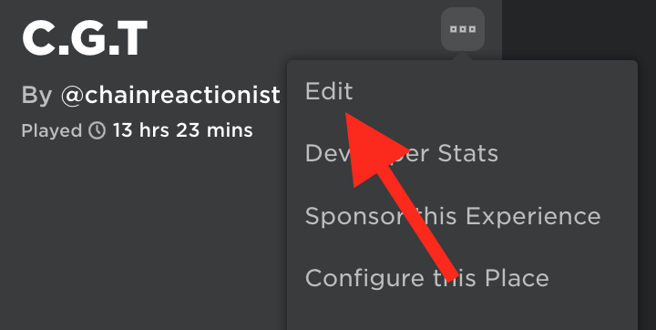
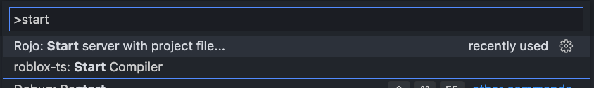
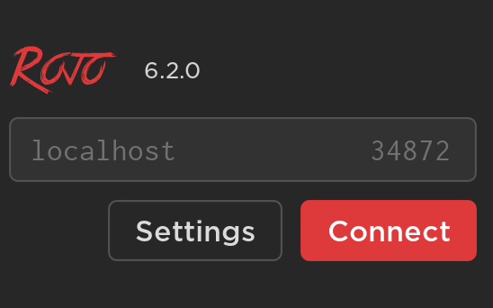

## Installation

=== "Clone the latest release game"
    1. Go to <a href= "https://www.roblox.com/games/9108577465/C-G-T" target = "_blank">`https://www.roblox.com/games/9108577465/C-G-T`</a>.
    2. Click on the 3 dots.
    3. And click edit.
    { align=left }

=== "VS Code Release"
    1. Go to <a href= "https://github.com/Chainreactionist/C.G.T/releases/latest" target = "_blank">`https://github.com/Chainreactionist/C.G.T/releases/latest`</a>.
    2. Download the .zip file.
    3. Unzip the file by double clicking it and opening it in visual studio code or your editor of choice.
    4. Out of the box all you need to do next is `Start Rojo` using to VS code rojo plugin and then connect using the roblox studio roblox plugn.
    { align=left }
    { align=left }

!!! info
    A plugin is in the works to load different versions of `C.G.T` in the future